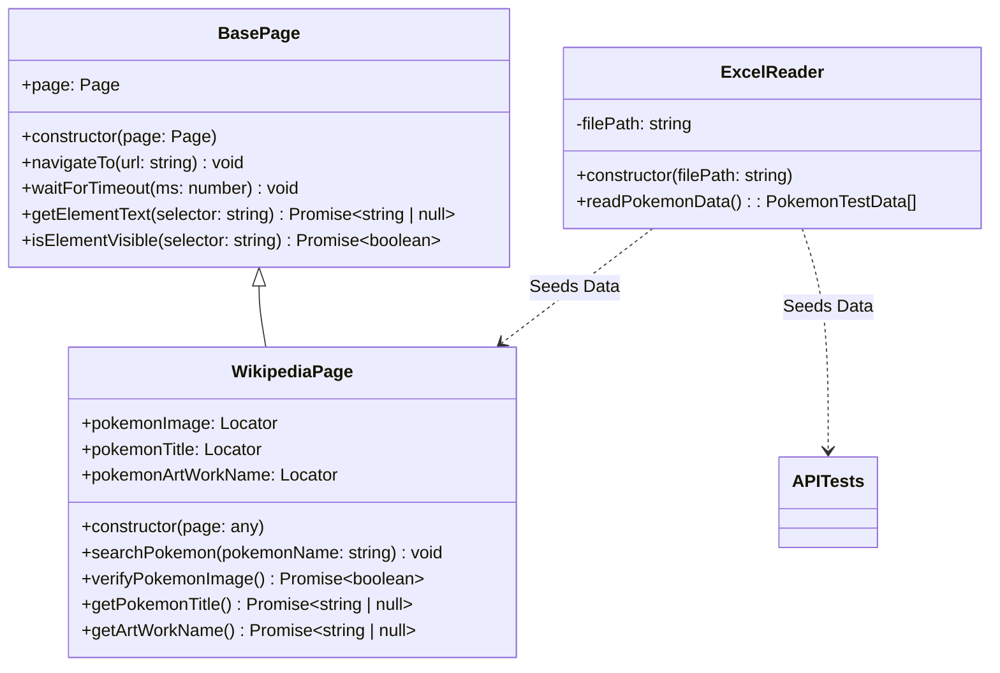
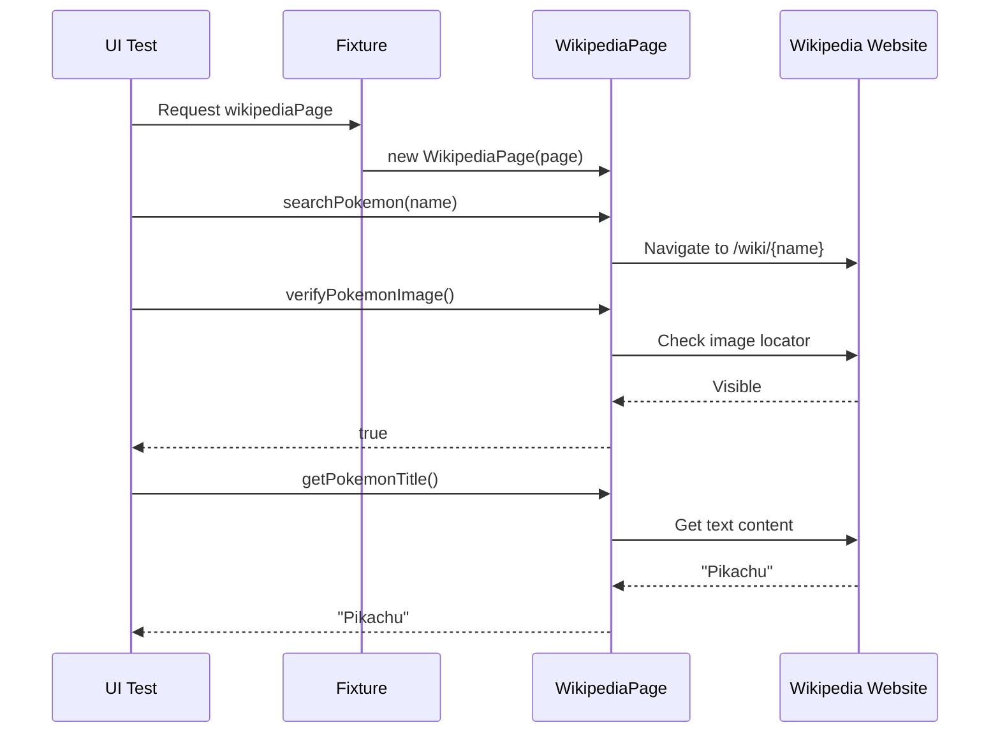
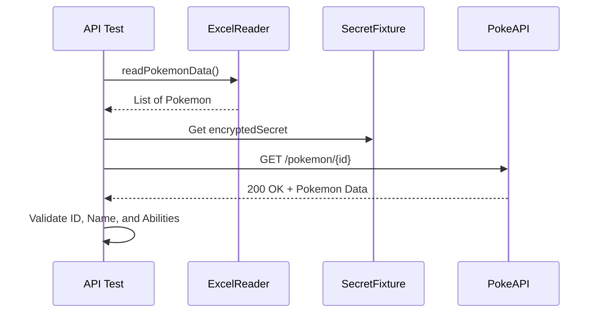
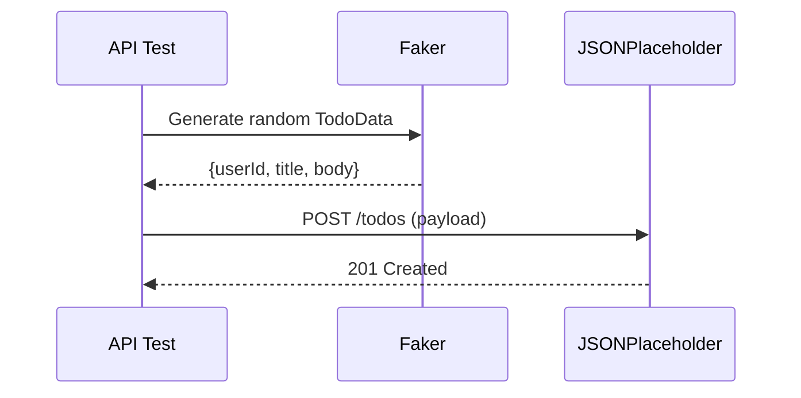
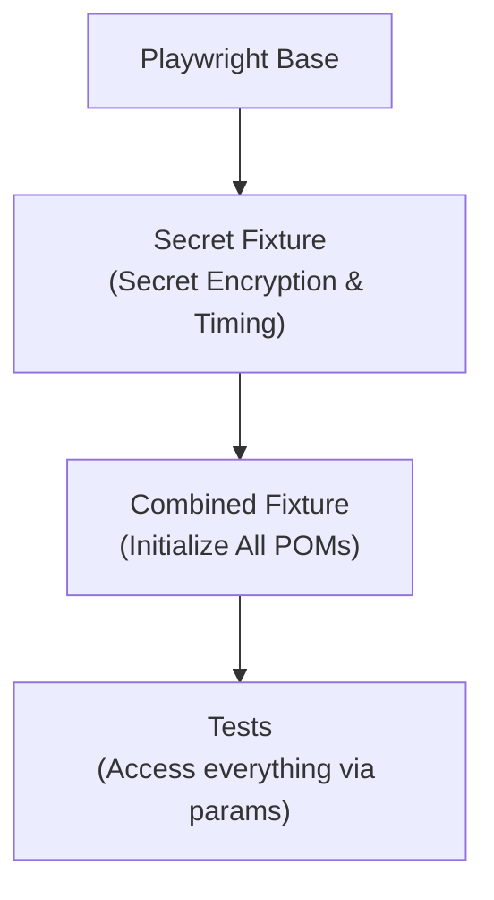

# Challenge Automation Playwright - Typescript

This project is a high-quality Playwright automation suite using TypeScript, designed with maintainability, scalability, and security in mind. It implements the Page Object Model (POM), utilizes advanced Fixtures for cross-cutting concerns, and supports Data-Driven Testing (DDT) via Excel.

## ✨ Key Features

- **Page Object Model (POM)**: Encapsulates page logic for better reusability.
- **Advanced Fixtures**: Custom fixtures for API secrets, specialized timing, and page initialization.
- **Data-Driven Testing (DDT)**: Seamless integration with Excel for dynamic test data management.
- **Multi-Environment Support**: Built-in support for `DEV`, `QA`, `STG`, `CERT`, and `PROD`.
- **Security**: Automatic SHA-256 hashing of sensitive environment secrets.
- **Reporting**: Comprehensive HTML reports generated after every run.
- **Type Safety**: Fully typed codebase using TypeScript interfaces and declarations.

## 📁 Project Tree

```text
.
├── Data
│   └── Datos-pruebas.xlsx          # Test data for Pokemon search (Excel format)
├── fixture
│   ├── basePage.fixture.ts        # Fixture for BasePage initialization
│   ├── combined.fixture.ts        # Aggregated fixtures for easy test imports
│   └── secret.fixture.ts          # Advanced logic for env secrets and timing logs
├── pages
│   ├── BasePage.ts                # Base class with core Playwright wrappers
│   └── wikipediaPage.ts           # Wikipedia-specific interaction logic
├── tests
│   ├── api
│   │   ├── jsonplaceholder-test.spec.ts
│   │   └── pokeapi-test.spec.ts
│   ├── ui
│   │   └── wikipedia-test.spec.ts
│   └── example.ts
├── types
│   └── pokemon.d.ts               # Global TypeScript typings for API and Excel data
├── utils
│   └── excelReader.ts             # XLSX parsing utility with data transformation
├── .env                           # Local environment secrets (not in git)
├── playwright.config.ts           # Global configuration (Firefox focused)
├── package.json
└── README.md
```

## 🏗️ Technical Architecture

### UML Class Diagram


### Sequence Diagrams

#### 1. Wikipedia UI Search


#### 2. PokeAPI Request (Data Driven)


#### 3. JsonPlaceholder POST (Faker Data)


### 💉 Fixture Architecture
This project uses a layered fixture approach to provide tests with powerful capabilities without boilerplate.



#### Specialized Fixtures:
- **`encryptedSecret`**: Automatically detects `TEST_ENV`, retrieves the corresponding key from `.env`, and returns a **SHA-256 hash**.
- **`testTime`**: An automatic timer that logs the exact start/end time and duration of every test case to the console.

## 🔑 Environment Configuration

Create a `.env` file in the root directory with the following variables based on your environment:

```ini
TEST_ENV=dev # Options: dev, qa, stg, cert, prod

# Environments Secrets (Pick based on TEST_ENV)
DEV_SECRET_KEY=my_dev_key
QA_SECRET_KEY=my_qa_key
STG_SECRET_KEY=my_stg_key
CERT_SECRET_KEY=my_cert_key
PROD_SECRET_KEY=my_prod_key
```

## 🌐 Browser Configuration

The project is optimized for **Firefox** to ensure consistency across the automation suite.

Configuration snippet in `playwright.config.ts`:
```ts
  projects: [
    {
      name: 'firefox',
      use: { ...devices['Desktop Firefox'] },
    },
  ],
```

## 🚀 Execution & Reporting

> [!IMPORTANT]
> To maintain execution order and avoid data contention, always run with `--workers=1`.

### Commands
- **Run all tests**: `npx playwright test --workers=1`
- **Run specific file**: `npx playwright test tests/ui/wikipedia-test.spec.ts --workers=1`
- **Run with specific environment**: `TEST_ENV=dev  DEV_SECRET_KEY=automation_DEV npx playwright test --workers=1`

### Viewing Reports

#### Playwright HTML Report
```bash
npx playwright show-report
```

#### Allure Report
1. **Generate Report:**
   ```bash
   npx allure generate allure-results --clean -o allure-report
   ```
2. **Open Report:**
   ```bash
   npx allure open allure-report
   ```

## 🛠️ Step-by-Step Project Creation (from scratch)

1.  **Initialize Project**: `npm init -y`
2.  **Install Playwright Core**: `npm install @playwright/test`
3.  **Install Browser**: `npx playwright install firefox`
4.  **Install Essential Utilities**:
    - `npm install xlsx --save-dev` (Excel support)
    - `npm install dotenv --save-dev` (Environment management)
    - `npm install @faker-js/faker --save-dev` (Dynamic data)
    - `npm install @types/node --save-dev` (Typing support)
5.  **Install Allure Reporting**:
    - `npm install allure-playwright allure-commandline --save-dev`
6.  **Configure Playwright**: Create `playwright.config.ts`.
    - Set `projects` to only use `firefox`.
    - Add Allure reporter:
      ```ts
      reporter: [['list'], ['allure-playwright']],
      ```
7.  **Setup Directory Structure**: Create `pages`, `tests`, `fixture`, `utils`, `types`, and `Data` directories as shown in the tree.
